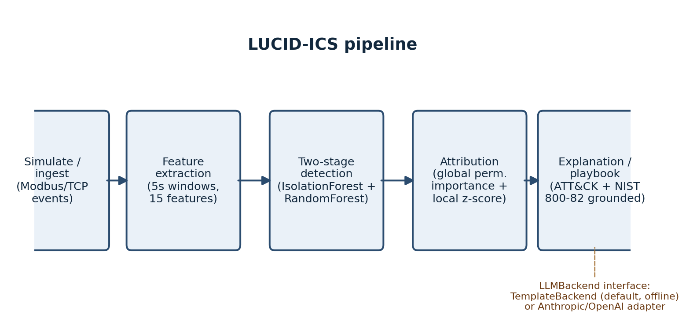
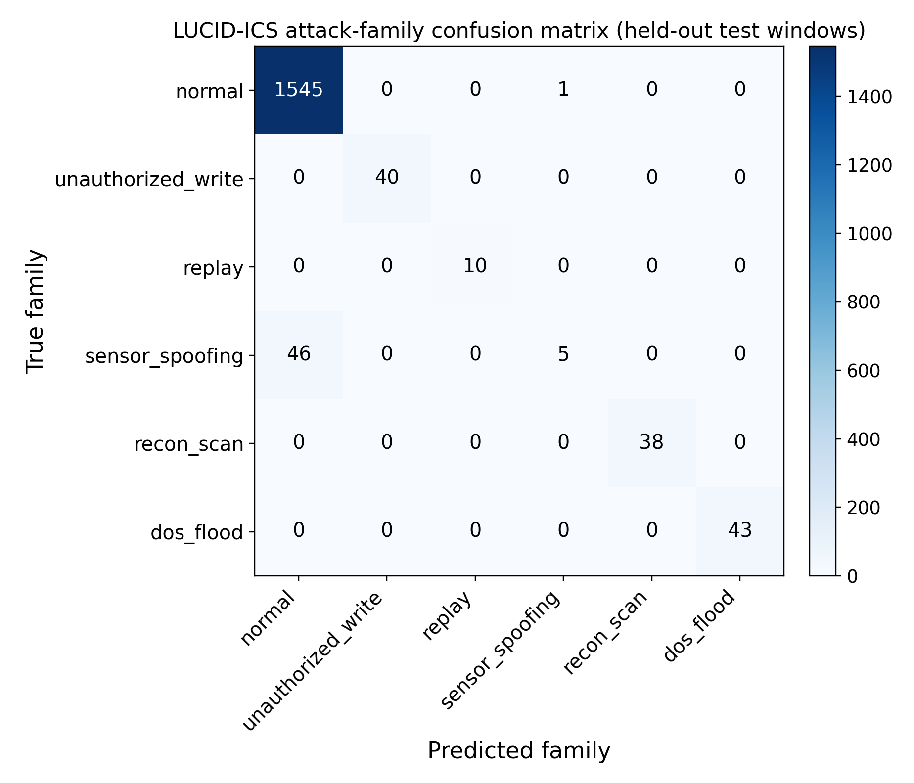
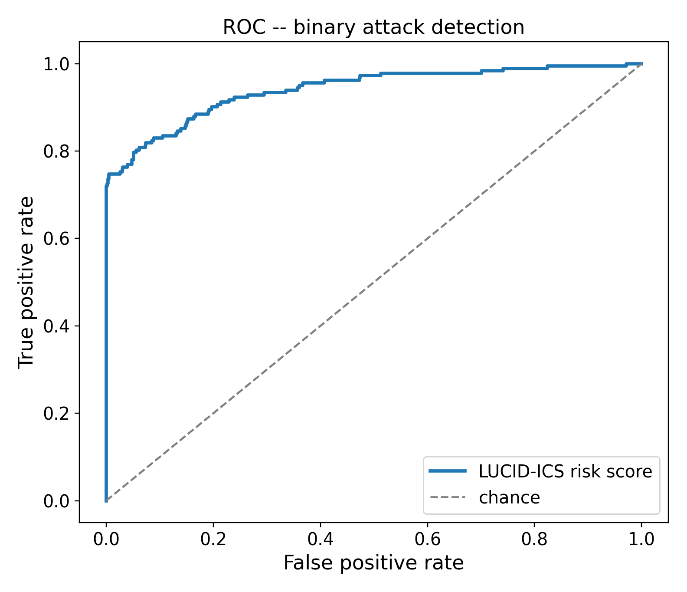
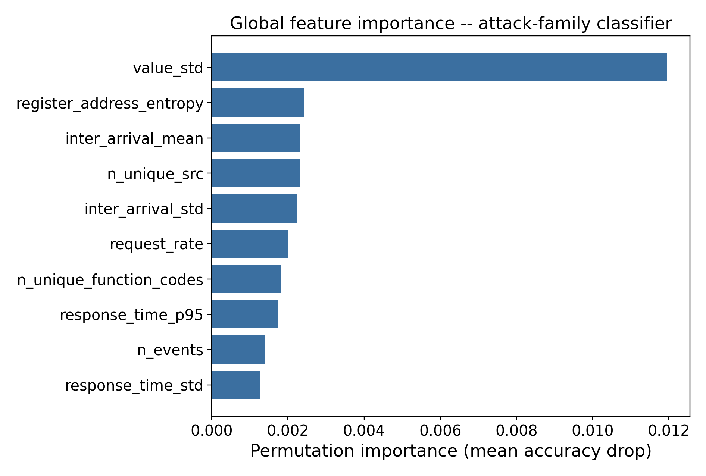
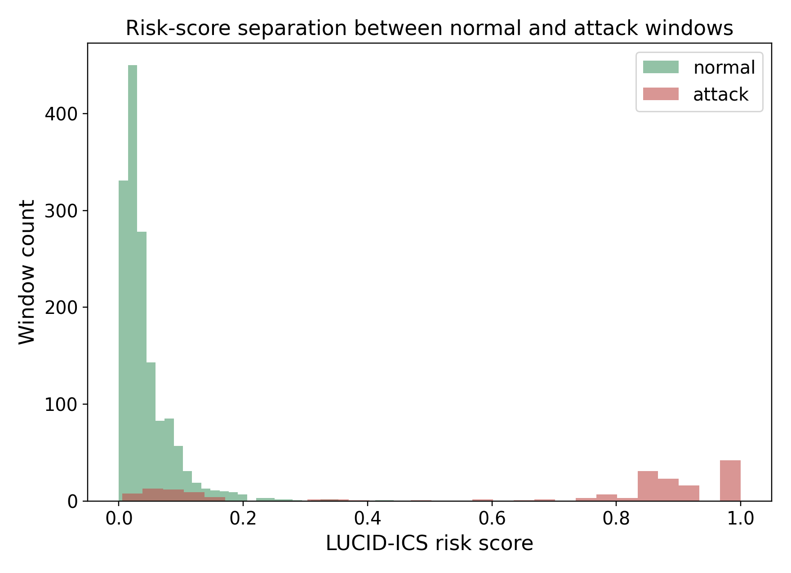

<div align="center">

# LUCID-ICS

**An explainable, LLM-ready triage framework for SCADA/ICS intrusion detection**

[](LICENSE)
[](pyproject.toml)
[](tests/)
[](#paper-status)

[**Live Project Site**](https://sunilgentyala.github.io/lucid-ics/) &nbsp;·&nbsp;
[**Quickstart**](#quickstart) &nbsp;·&nbsp;
[**Results**](#results-10-independent-6-hour-simulated-trials) &nbsp;·&nbsp;
[**License**](#license)

</div>

---

Companion open-source framework for a paper accepted at the 2nd IEEE MILCOM Workshop on Industrial Control Systems and Critical Infrastructure Security (ICSCI 2026). Per IEEE's copyright policy, the manuscript itself is not published in this repository or on the project site — only the abstract and formal citation (with a link to IEEE Xplore) will be added once available; everything else — the framework, experiment harness, and every reported result — is public here.

## Why

ML-based ICS/SCADA intrusion detectors are usually evaluated purely on accuracy. In practice, adoption is blocked by a different problem: operators can't act on an alert they don't understand and don't trust. LUCID-ICS treats explanation as a first-class, swappable pipeline stage — not a post-hoc visualization bolted onto a black box.

<div align="center">

</div>

## What it does

1. **Synthetic ICS traffic testbed** (`simulator.py`) — an original Modbus/TCP process simulator (PID-controlled tank level) with five injected attack families: unauthorized command writes, replay, sensor-value spoofing, reconnaissance scanning, and DoS flooding. Built from scratch because no public, redistributable ICS dataset could be fetched inside this project's build step.
2. **Feature extraction** (`features.py`) — windows raw protocol events into 15 statistical/protocol features.
3. **Two-stage detector** (`detector.py`) — an unsupervised Isolation Forest novelty score combined with a supervised, class-balanced Random Forest attack-family classifier, using a time-block (not random) train/test split.
4. **Attribution** (`attribution.py`) — global permutation importance + local per-alert z-score attribution against the learned normal-traffic baseline.
5. **Explanation/playbook** (`explain.py`, `knowledge_base.py`) — maps each predicted attack family to a verified MITRE ATT&CK for ICS technique and a NIST SP 800-82-aligned response checklist, then renders an operator-readable narrative behind a one-method `LLMBackend` interface. The default `TemplateBackend` is fully offline and deterministic (no API key needed); `AnthropicBackend`/`OpenAIBackend` are working adapters for teams that want a live-LLM narrative instead — **not exercised in the reported results below**, since no API credentials were available in the build environment. That's disclosed explicitly rather than hidden.

## Results (10 independent 6-hour simulated trials)

| Metric | Value |
|---|---|
| Binary precision | 0.993 ± 0.007 |
| Binary recall | 0.843 ± 0.130 |
| Binary F1 | 0.907 ± 0.084 |
| ROC-AUC | 0.959 ± 0.035 |
| Attack-family accuracy | 0.985 ± 0.011 |
| Attack-family macro-F1 | 0.914 ± 0.039 |
| Mean explanation latency (template backend) | 11.9 ± 2.2 µs |

Four of five attack families are detected essentially perfectly (per-family recall ≥ 0.98). **Sensor-spoofing (slow-onset sensor drift) is detected far less reliably and far less consistently** — mean recall 0.39 ± 0.22, ranging 0.04–0.76 across the ten trials. This is a real, reported limitation (not hidden): per-window statistical features can't see a trend that unfolds gradually across many windows.

<table>
<tr>
<td width="50%"></td>
<td width="50%"></td>
</tr>
<tr>
<td width="50%"></td>
<td width="50%"></td>
</tr>
</table>

Full figures: [`results/figures/`](results/figures/). Full metrics: [`results/metrics_summary.json`](results/metrics_summary.json). Sample generated alerts: [`results/sample_alerts.md`](results/sample_alerts.md).

## Quickstart

```bash
pip install -e .
python -m lucid_ics.cli --duration 3600 --show-alerts 5
```

Or use it as a library:

```python
from lucid_ics.pipeline import run_pipeline
from lucid_ics.simulator import SimulationConfig

metrics, records, importance = run_pipeline(sim_config=SimulationConfig(duration_s=3600.0))
print(metrics.binary_f1, metrics.family_accuracy)
```

Reproduce every number and figure above:

```bash
python experiments/run_experiment.py --config experiments/configs/default.yaml
```

## Plugging in a real LLM backend

```python
from lucid_ics.explain import AnthropicBackend, explain_alert
# requires ANTHROPIC_API_KEY in the environment and `pip install anthropic`
backend = AnthropicBackend(model="claude-sonnet-5")
# pass backend=backend to explain_alert(...) or run_pipeline(..., backend=backend)
```

`OpenAIBackend` works the same way for GPT-class models. Any other model just needs to implement `LLMBackend.generate(prompt: str) -> str`.

## Repository layout

```
src/lucid_ics/        the framework (simulator, features, detector, attribution, explain, knowledge_base, pipeline, cli)
tests/                 pytest suite
experiments/           experiment config + run_experiment.py (produces results/)
results/               metrics, figures, and sample alerts from the reported run
docs/                  GitHub Pages project site
```

## Paper status

Accepted for publication at IEEE MILCOM 2026 WS14 (ICSCI); camera-ready in progress ahead of IEEE Xplore publication. The manuscript (LaTeX source and compiled PDF) is intentionally never included in this repository or hosted on the project site, in line with IEEE's copyright policy once copyright is transferred — only the abstract and formal citation (with a link to IEEE Xplore) will be added here once available.

## License

MIT — see [LICENSE](LICENSE).
